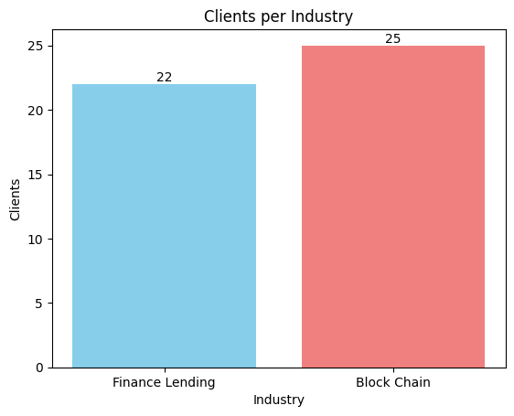
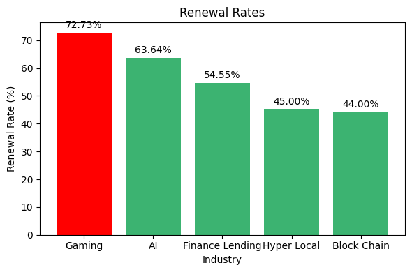
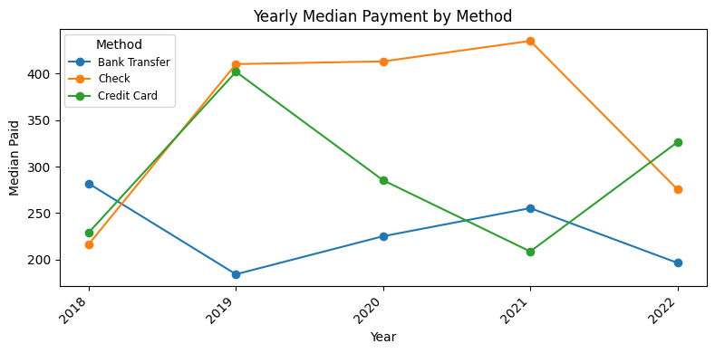

## 🗂️ Dataset Summaries

### 1. `finanical_information.csv`

| Column Name      | Description                                   |
|------------------|-----------------------------------------------|
| `start_date`     | The beginning of the time period              |
| `end_date`       | The end of the time period                    |
| `inflation_rate` | The rate of inflation during the period       |
| `gdp_growth_rate`| The rate of GDP growth during the period      |

---

### 2. `industry_client_details.csv`

| Column Name      | Description                                   |
|------------------|-----------------------------------------------|
| `client_id`      | Unique identifier for each client             |
| `company_size`   | Size category of the company (e.g., Small, Medium, Large) |
| `industry`       | Industry in which the client operates (e.g., Finance Lending, Blockchain) |
| `location`       | Client’s geographical location                |

---

### 3. `payment_information.csv`

| Column Name      | Description                                   |
|------------------|-----------------------------------------------|
| `client_id`      | Identifier for the paying client             |
| `payment_date`   | Date when the payment was made                |
| `amount_paid`    | Total amount paid                             |
| `payment_method` | Method of payment used (e.g., Credit Card, Bank Transfer) |

---

### 4. `subscription_information.csv`

| Column Name      | Description                                   |
|------------------|-----------------------------------------------|
| `client_id`      | Identifier linking to a client                |
| `subscription_type` | Plan type subscribed to (e.g., Basic, Premium) |
| `start_date`     | Subscription start date                       |
| `end_date`       | Subscription end date                         |
| `renewed`        | Boolean indicating if the subscription was renewed |

---

## 🧾 Overview of Questions

### 1. **How many Finance Lending and Blockchain clients does the organization have?**

To answer this question, we analyzed the `industry_client_details.csv` dataset to count the number of unique clients in two specific industries: **Finance Lending** and **Blockchain**. We utilized the `client_id` field to ensure we are counting distinct clients in each industry.

**Image 1**:  

---

### 2. **Which industry has the highest renewal rate?**

This question was tackled by merging the `industry_client_details.csv` and `subscription_information.csv` datasets on `client_id`. By grouping the data by industry, we calculated the renewal rate for each industry and identified which one has the highest percentage of subscription renewals.

**Image 2**:  

---

### 3. **What was the average inflation rate when subscriptions were renewed?**

To find the average inflation rate during subscription renewals, we merged the `subscription_information.csv` dataset with `finanical_information.csv` on the `start_date` field. By filtering for records where the subscription was renewed, we computed the mean of the `inflation_rate` field to provide the answer.

---

### 4. **What is the median amount paid each year for all payment methods?**

We calculated the median amount paid each year by analyzing the `payment_information.csv` dataset. The `payment_date` field was converted to a datetime format, and we grouped the data by year and payment method. The median amount paid was computed for each combination of year and payment method.

**Image 3**:  

---

## 📂 Datasets Used

| Dataset Name                | Description |
|----------------------------|-------------|
| `industry_client_details.csv` | Contains client ID, industry, location, and company size |
| `subscription_information.csv` | Tracks subscription start, end, and renewal status |
| `finanical_information.csv`   | Contains economic indicators like inflation rate |
| `payment_information.csv`    | Logs client payment activity |

